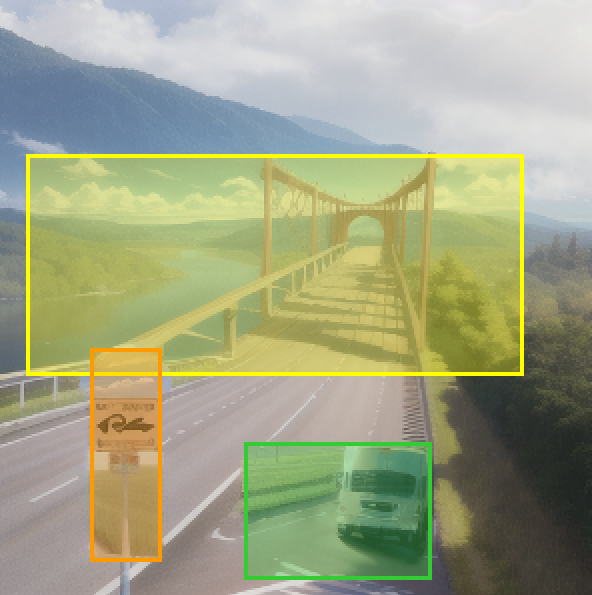

# Automated Polygon Generation for Improved Text-to-Image Synthesis

An Enhanced Pipeline for Better Object Placement in Generated Images



## Overview

This project presents a pipeline that integrates **Llama 3** with the **MultiDiffusion** model to automate the generation of bounding polygons for objects in text-to-image synthesis. By leveraging Llama 3's spatial reasoning capabilities, the pipeline enhances image generation by ensuring logical placement of objects as described in complex text prompts.

## Features

- **Automated Polygon Generation**
  - Integrates Llama 3 to automatically generate bounding boxes for objects, eliminating the need for manual adjustments.

- **Enhanced Text-to-Image Synthesis with MultiDiffusion**
  - Improves the MultiDiffusion model to produce high-quality images that accurately reflect complex text prompts, ensuring all objects are present in the final image with logical placements.

- **Streamlined and Efficient Image Generation Pipeline**
  - Reduces manual intervention and computational overhead, optimizing the workflow for faster and more efficient image synthesis that closely aligns with textual descriptions.
  - Utilizes a user-friendly UI for ease of use.

## Installation and Usage

### Prerequisites

- **Python 3.10.6**
  - Note: Newer versions of Python may not support `torch`.
- **Git**
- **Hugging Face Account**
  - Obtain an API token for Llama 3 from [Hugging Face](https://huggingface.co/).

### Installation

1. **Clone the Repository**

   Open your terminal or command prompt and run:

   ```bash
   git clone https://github.com/MonkeySitter/DL-Project-Diffusion-Pipeline.git
   ```

2. **Download a Diffusion Model**

   - Place the downloaded model in the `Models` folder within the cloned repository.

3. **Install Required Python Packages**

   Navigate to the project directory and install the required packages:

   ```bash
   pip install -r requirements.txt
   ```

4. **Install the MultiDiffusion Upscaler Extension**

   Create an `extensions` folder if it doesn't exist, navigate into it, and clone the MultiDiffusion upscaler:

   ```bash
   mkdir extensions
   cd extensions
   git clone https://github.com/pkuliyi2015/multidiffusion-upscaler-for-automatic1111.git
   ```

5. **Obtain a Llama 3 API Token**

   - Sign up or log in to your Hugging Face account.
   - Navigate to your account settings to generate an API token.
   - Save this token; you'll need it for running the pipeline.

### Usage

1. **Generate Configuration Files**

   - Open the `One_step_approach.ipynb` notebook using Jupyter Notebook or any compatible environment.
   - Replace the placeholder with your Hugging Face API token when prompted.
   - Run the notebook to generate the configuration files needed for image generation.

2. **Run the Application**

   Navigate back to the project root directory and start the application:

   ```bash
   python launch.py --listen --port 7860
   ```

   - The `--listen` flag allows connections from other machines.
   - The `--port` flag specifies the port number (you can change `7860` to any available port).

3. **Optimize and Generate Images**

   - Open a web browser and navigate to `http://localhost:7860` or `http://your-server-ip:7860` if running on a remote server.
   - Load your configuration file.
   - Adjust the sliders and settings to optimize the image generation process according to your preferences.
   - Initiate the image generation and view the results directly in the UI.


## Credits
Licenses for borrowed code can be found in `Settings -> Licenses` screen, and also in `html/licenses.html` file.

- Stable Diffusion - https://github.com/Stability-AI/stablediffusion, https://github.com/CompVis/taming-transformers, https://github.com/mcmonkey4eva/sd3-ref
- k-diffusion - https://github.com/crowsonkb/k-diffusion.git
- Spandrel - https://github.com/chaiNNer-org/spandrel implementing
  - GFPGAN - https://github.com/TencentARC/GFPGAN.git
  - CodeFormer - https://github.com/sczhou/CodeFormer
  - ESRGAN - https://github.com/xinntao/ESRGAN
  - SwinIR - https://github.com/JingyunLiang/SwinIR
  - Swin2SR - https://github.com/mv-lab/swin2sr
- LDSR - https://github.com/Hafiidz/latent-diffusion
- MiDaS - https://github.com/isl-org/MiDaS
- Ideas for optimizations - https://github.com/basujindal/stable-diffusion
- Cross Attention layer optimization - Doggettx - https://github.com/Doggettx/stable-diffusion, original idea for prompt editing.
- Cross Attention layer optimization - InvokeAI, lstein - https://github.com/invoke-ai/InvokeAI (originally http://github.com/lstein/stable-diffusion)
- Sub-quadratic Cross Attention layer optimization - Alex Birch (https://github.com/Birch-san/diffusers/pull/1), Amin Rezaei (https://github.com/AminRezaei0x443/memory-efficient-attention)
- Textual Inversion - Rinon Gal - https://github.com/rinongal/textual_inversion (we're not using his code, but we are using his ideas).
- Idea for SD upscale - https://github.com/jquesnelle/txt2imghd
- Noise generation for outpainting mk2 - https://github.com/parlance-zz/g-diffuser-bot
- CLIP interrogator idea and borrowing some code - https://github.com/pharmapsychotic/clip-interrogator
- Idea for Composable Diffusion - https://github.com/energy-based-model/Compositional-Visual-Generation-with-Composable-Diffusion-Models-PyTorch
- xformers - https://github.com/facebookresearch/xformers
- DeepDanbooru - interrogator for anime diffusers https://github.com/KichangKim/DeepDanbooru
- Sampling in float32 precision from a float16 UNet - marunine for the idea, Birch-san for the example Diffusers implementation (https://github.com/Birch-san/diffusers-play/tree/92feee6)
- Instruct pix2pix - Tim Brooks (star), Aleksander Holynski (star), Alexei A. Efros (no star) - https://github.com/timothybrooks/instruct-pix2pix
- Security advice - RyotaK
- UniPC sampler - Wenliang Zhao - https://github.com/wl-zhao/UniPC
- TAESD - Ollin Boer Bohan - https://github.com/madebyollin/taesd
- LyCORIS - KohakuBlueleaf
- Restart sampling - lambertae - https://github.com/Newbeeer/diffusion_restart_sampling
- Hypertile - tfernd - https://github.com/tfernd/HyperTile
- Initial Gradio script - posted on 4chan by an Anonymous user. Thank you Anonymous user.
- AUTOMATIC1111 - https://github.com/AUTOMATIC1111/stable-diffusion-webui
- pkuliyi2015 - https://github.com/pkuliyi2015/multidiffusion-upscaler-for-automatic1111
- Morris Alper - https://github.com/morrisalp/
